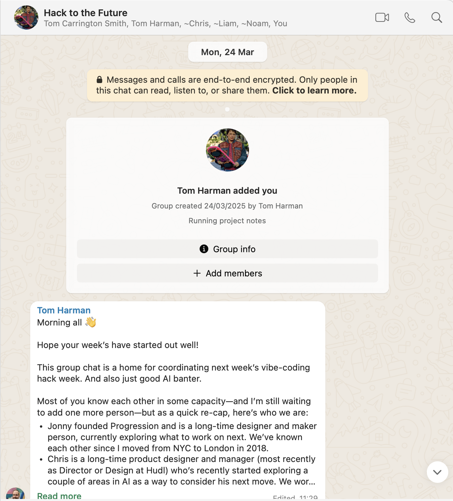

Sometime in April, six designers got together to 'vibe code'. (I was one of those designers).

Tom and I had got chatting about the confluence of our calendars being free for the first time in years, a set of tools we've had on our 'to-try' list for a while and an interest in working together on something. It was Tom who suggested we spend a week keeping each other accountable in a 'vibe hack week'. An absolute sucker for organised fun, I immediately said yes (and probably within a breath suggested we invite others).

After all, why bi-vibe when you can sex-vibe?! (weird, might delete this sentence later)

Hack to the future was born.

*Hack to the future*

[Tom](https://newsletter.intentional.partners/p/proof-of-vibes) and [Noam](https://noamso.medium.com/learnings-from-building-mighty-veg-a-4-day-vibe-coding-experiment-99b515b49462) have written excellently about their experiences of the week — short version is we had a lot of fun, everyone really leaned in, I think I learnt as much from other people's experiences as my own (often frustrating, overly ambitious) attempts.

*Vibers*

What Tom and I were left with alongside two half finished apps, was a feeling that 'more people should be doing this'.

## What's going on? I'm exhausted

Vibe coding, AI, oh god no. Many of us are using it to some extent, for auto-complete, search, telling us how many calories in a jacket potato. Meanwhile we're bombarded with AI IS THE FUTURE! TAKING OUR JOBS! I MADE AN APP THAT CAN LEAK YOUR DATA IN 6 MINUTES, HERE'S THE WAITLIST.

So exhausting. So much noise. What do we all do about it?

Ask your local software engineer and they'll have an opinion. Developers are at the cutting edge of this innovation - both at most risk of disruption but with the best grasp of where it's all heading.

But move outside the technical team and the insufferable vibe coding linkedin feed and it's less clear whether to lean in. After all, we're all busy.

And what I've not popped the Kool-Aid yet? What if I think it's all just like NFTs and if I ignore it for long enough it will go away?

## Lean in tho

Beware if that's you. It's absolutely fine to be sceptical. Hell, over 50% of the stuff I attempted in our vibe week was at best ok and at worst completely broken or impossible to push through. It's an absolutely fair opinion to have that in it's current state AI isn't the answer to really anything beyond speeding up tasks you already know, a bit.

So let me frame this in a different way for the sceptics. Ask yourself this: what is the percentage chance that AI really is the biggest (best/worst) version of what people are saying in various thinkpieces (like [here](https://sourcegraph.com/blog/revenge-of-the-junior-developer) and [here](https://ai-2027.com/))?

Say you assign that a 25% chance. Pretty sceptical, but it might happen.

Now think about where that would put you if that were true. Your career, the value of the work you do. Probably pretty impacted, right?

OK, so if you were in a plane with a 25% chance of a severe catastrophe, you'd probably do something about it right? Or better, there's a 25% chance you'll be evicted, or get some terrible disease with life changing impact, but there's something you can actually do about it (exercise, diet, negotiate with your landlord).

You'd do it right?

So even if you're sceptical, or don't like the ethical or environmental impacts, if you believe it might happen you owe it to yourself to lean in. Be sceptical! Critical thinking is good. But lean in.

## Rant over

So how do you lean in?

Carve out time to use AI.

Tom later showed me a paper on the 'Jagged Frontier' of AI. The paper is dense, but [the blog post](https://www.oneusefulthing.org/p/centaurs-and-cyborgs-on-the-jagged) introducting it is not. This paragraph really stood out:

> AI is weird. No one actually knows the full range of capabilities of the most advanced Large Language Models, like GPT-4. No one really knows the best ways to use them, or the conditions under which they fail. There is no instruction manual. On some tasks AI is immensely powerful, and on others it fails completely or subtly. And, unless you use AI a lot, you won’t know which is which.

"unless you use AI a lot, you won’t know which is which". Damn. Use AI.

Use AI.

Not just as a search box in chatGPT. Use it to problem solve, optimise your daily work, build things you had assumed you'd need someone technical to do.

Not to make internet money, or for cool points.

Because that knowledge is the difference between being able to navigate the world we're (25%) moving into, and not. Being able to triple your impact at work and justify your role, or speak the language of the business as it transitions. Or just to keep your eyes open to opportunities that inevitably appear as this all unfolds.

## Anyway

Our vibe week was fun. Cringe, demoralising at times, but with smart peers building fun things, definitely fun. Your travels through AI right now can be just that! Creative, exploratory, low pressure.

Do it with friends! Do it alone! Do it naked!

Just don't wait until you're (25%) playing catch up with your livelihood on fire.