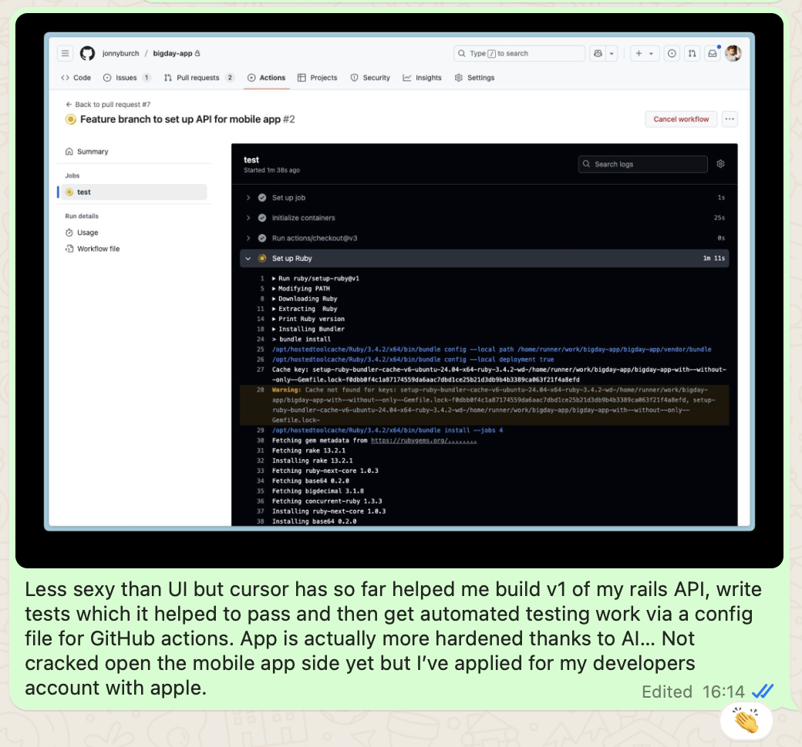
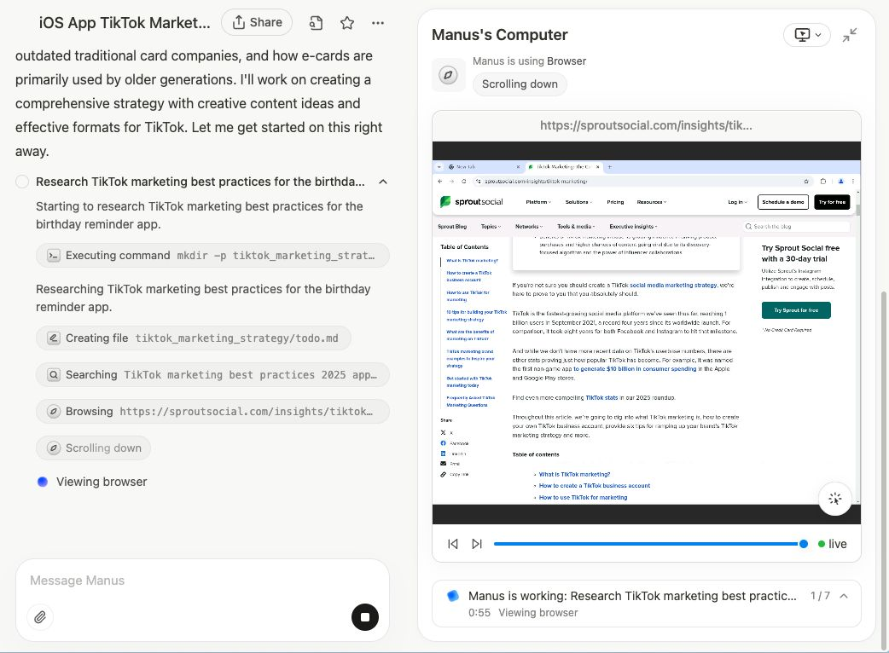
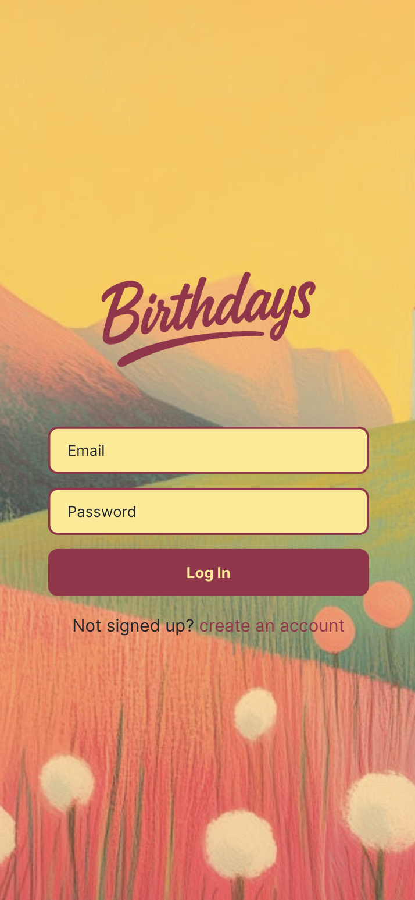

Sometime in April, six designers got together to 'vibe code'. (I was one of those designers).

My pal [Tom](https://intentional.partners/) and I had been chatting about the confluence of our calendars being free for the first time in years, a set of tools we've had on our 'to-try' list for a while and an interest in working together on something. It was Tom who suggested we spend a week keeping each other accountable in a 'vibe hack week'. An absolute sucker for organised fun, I immediately said yes (and probably within a breath suggested we invite others).

After all, why bi-vibe when you can sex-vibe?! (weird, might delete this sentence later)

Hack to the future was born.

*Hack to the future*

## How did it work?

The structure of the week (or 4 days) was a kick off on the Monday morning, morning standup on Tuesday Wednesday and Thursday and then a demo on Thursday afternoon. Our whatsapp group throughout was a flurry of learnings, links and updates. We had pretty much all planned our projects before the week, so most of the time in-between was execution.

- Tom chose to build an iOS app for parents to use when playing with their children — to come up with ideas for games and activities. As a parent of a busy 3 year old, this excited me.
- Tom Carrington Smith went for a 'podcast generation' chrome extension - bookmark interesting links and AI will write then record a summary podcast, dropped into your inbox once a week.
- Liam decided to focus on the technology Flutterflow, building an app to automatically collect and share screenshots of app UI.
- Noam decided to build an app to convert meaty recipes into veggie ones, using AI image processing.
- Chris leant on his background working for media companies to build a swipeable headline summariser for busy people wanting to catch up on the news.
- And finally, I chose to build an iOS app for my existing personal birthday reminder web app, using react native and expo. More on that below.

The only real rule was 'vibe code'. As we were all designers this wasn't a difficult brief - in terms of experience writing code we ranged from none to some.

[Tom](https://newsletter.intentional.partners/p/proof-of-vibes) and [Noam](https://noamso.medium.com/learnings-from-building-mighty-veg-a-4-day-vibe-coding-experiment-99b515b49462) have written excellently about their experiences of the week, which you should definitely check out.

But before it disappears from memory, here's a few learnings from my journey.

*Vibers*

## To vibe or to ship?

I've been using a personal app to help me remember my friends, family and family-of-friends' birthdays for about 9 months now. For the two years before that I had an airtable setup. I'm just terrible at remembering birthdays, so to have an email in my inbox when it's someone's birthday (or advance warning for important people) can be a lifesaver. I'm at around 60 birthdays now, so there's usually at least 2-3 a month.

*Birthdays on web*

Quite quickly when we started we discussed our personal goals for the week and split into 'people who want to just learn with no particular goal' and 'people who want to ship something specific'. I was definitely in the latter camp.

I've always wanted to build an iOS app. I was getting into tech when the app store was coming to the fore, in the early '10s - and for some reason even though I've been building websites and web apps for nearly two decades now, mobile apps have felt like too much of a leap. A new language, a new tool (I'll get onto xcode later...), app store approval. Never tried as a result.

So I went into this week with one goal - to get an app into testflight.

In retrospect I was setting myself up for a fail here, especially as I hadn't applied for an Apple developer account yet. And that was going to prove the least of my issues.

## A smooth start

First thing after kickoff I applied for the Apple developer account - 48 hours to approval. That would put me at Wednesday midday before even paying up and submitting a testflight build for approval.

Undeterred, I set about building an API on my rails web app.

This was truly fun. Me and cursor just moving fast and vibing together. I'm a solid junior rails dev, so I could follow everything going on - correcting assumptions, guiding a plan and running tests. I barely wrote a line of code, but on the odd occasion where cursor struggled I could step in.

I think we wrote an API covering the basics of the app functionality (auth, reading all models) in about 90 minutes, and I even got claude to write a throwaway program to test the auth side. By the end of Monday I felt like Boris from Goldeneye: "I am invincible!"

I pushed to prod and then (cheating? Not sure) did an extra late night vibe coding session on the mobile side, managing to get auth and a basic list view going on the web preview. This was going to be easy right?

## Beware the config

On day two my woes started. They mainly started when I opened xcode.

It turns out, vibe coding is not a vibe when you're trying to set up config in a tool you've barely used before, using a stack you've not used before, with an AI that isn't great at thinking critically.

I had recently upgraded Xcode to the latest version, which (it turns out) had broken some aspect of a specific version of expo that I was using _the day before_. Builds failing, with big red 'screens of death'.

Claude didn't know this yet, but (because AI) couldn't just say "I don't know".

So instead we went through a couple of infuriating hours of the AI confidently pointing out the issue, offering a fix and that fix not working. We'd go down a rabbit hole, I'd get frustrated and end up `git reset ~HARD`ing back to where we were before, then trying again.

In the end I took to Google and found the bug report in the Expo github repo. I shared this with Cursor and eventually had to re-install an earlier version of xcode which was extremely dull and un-vibey. Barely any progress, day two wasted (and no developer account approval).

It was at this point that Tom, having been battling xcode too, decided to pivot to a web app.

_Lesson here: I suspect for anyone trying to vibe code, but especially if you're not super technical, pick your scope and your technology choices wisely. Right now there isn't a great workflow (that we found) for building native apps. That will probably change, but you're still better off with boring javascript and well documented technology like Rails._

## Day 3 - let's do some marketing?!

Nah, of course I didn't do any marketing. However, an invite for [Manus](https://manus.im), a tool that I'd signed up for a while back, dropped in my inbox. So frustrated was I with banging my head against Xcode that I clicked.

Manus's pitch was/is that it's a smart agent that can use a computer. It's quite jolly actually, you give it instructions and then it writes its own plan, asks you to approve then gets to work. You can watch it using its little computer, writing notes for itself and updating the plan, before delivering the final result.

So I thought, let's use some Manus magic to come up with a Tiktok strategy for my app. After working on it for about 20 minutes, searching the web and compiling a report, it asked me if I wanted it as a website. Obviously! [Here it is](https://uayqfays.manus.space/).

_I should probably drop this on linkedin with a 'reply with Tiktok to get it in your inbox'. Seems about that level of quality._

Regardless, this felt like an easy win and a good dopamine hit. And it worked, I'm now a paid up subscriber. It's pretty expensive as a service, but they keep giving me more free credits. Ride the VC money-bus!

Thursday brought with it a final push on the iOS app. I still didn't have a developer account so I'd lost all hope of getting my app onto a real phone, but I could still make progress on functionality.

Cursor and I got back into a vibe again when we started integrating the API into some UI and styling it. I learned early on that Tailwind, my styling library of choice, is not that great a choice for react native — so I went for Tamagui (thanks Josh for the steer!). It ended up not really mattering as I didn't write any of the styling anyway - I just generated an image or two on chatGPT to use as some backgrounds and the AI basically did the rest.

*Vibed iOS styling (I'd share more but at the time of writing the app doesn't run...)*

Honestly I don't love the resulting UI (I think I still prefer the web one, which I also don't love), but whatever. It looked like a thing by the end.

I'll probably keep hacking on this, and I now do have a developer account so watch out for a testflight build...

## Accountability and shared learnings

A few things stood out about the week for me.

1. Vibe coding is fun, but if you're trying to build something you intend to really work (as I did with Birthdays) it's not going to get you the whole way. It massively sped me up in safe, well documented "grunt-work' type tasks, but barely helped with gnarlier stuff. Which is a pity because that's the stuff I want to avoid.
2. Across the group we covered a lot of ground - from true vibe coding tools like lovable and replit to vibing with voice, from fairly technical to barely technical people. We learnt and discussed together, both the practical issues and the implications and the feelings we got from working in this way. Doing it as a group was invaluable and made it a whole load more fun.
3. I'm pretty certain that we're nowhere near the ceiling of where this technology will go. The biggest challenge be a technical one, but a generation of people used to working in one way having to adapt to work in another. Similar to suddenly going remote in 2020, this just feels categorically different as a way of working. Some will love it, many won't.

## What next?

I originally wrote a whole other post on the end of this one, but some editorial guidance (thanks Tom) has moved it over [here](/lean-in). Please do give it a read and tell me what you think!
