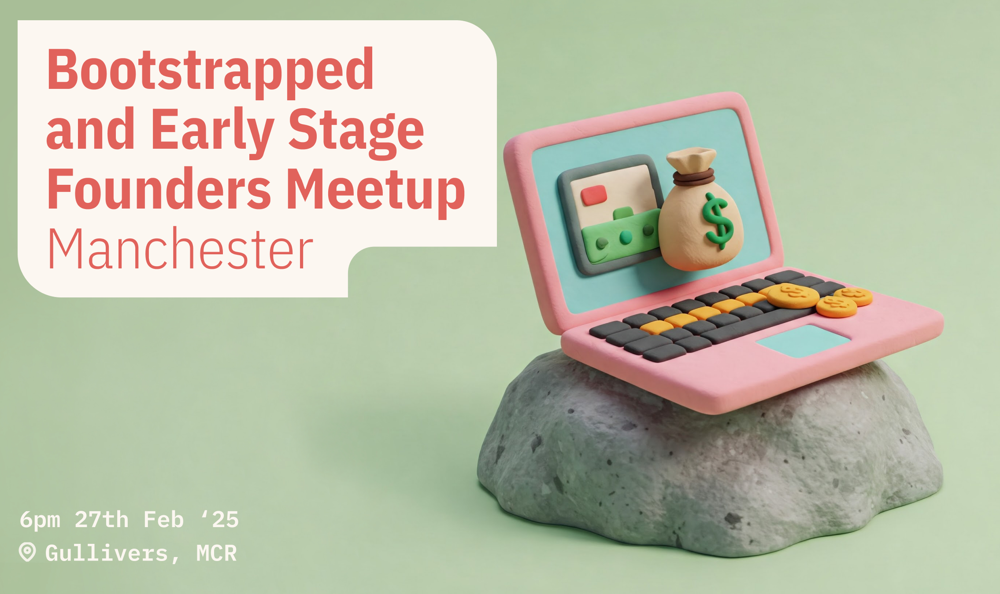

First journal post in a while, and it's because I'm back on my shit.

Just over two years ago I moved from East London, where I've built my career, to Manchester.

Manchester is honestly great. I enjoy living here more every day - from the amazing scenery on our doorstep, to building friendships (it turns out these things take time) and discovering more of the music and food scene. I'm now back to regularly going to gigs and finding running, drinking and nerding buddies all over the place. A second wind on our social life.

However, one part of Manchester I've failed to stumble into is the startup scene.

It's absolutely been my fault in large part - I've been focused on building (then selling) my company, working either with Londoners or fully remote throughout. Post covid, there just hasn't ever been a strong need to do more than sit in my home office.

But in reflecting on the Progression journey and trying to work out what I'd change next time, one thing I realised was personally how much I've missed working in person with people. And it's pretty clear, with a 3yo now in school, that we're not leaving the North any time soon.

## Potential

The North — especially for me, the North West including Manchester and Liverpool — has so much going for it. And there is in fact a real startup scene. But I'm pretty sure it's not just that I'm bad at Googling - I can't for the life of me find much real community around it.

I'm not talking about corporate-run tech events. I'm talking about people building together, raising each other up and building shared momentum. The shared optimism and belief that San Francisco is famed for, built around tables with laptops and coffee, or in back rooms of pubs where serendipity reigns.

I [posted about this on Linkedin]([/posts/the-north-needs-more-startups](https://www.linkedin.com/posts/jonnyburch_the-north-needs-more-startups-having-moved-activity-7289652377182167041-BC6_?utm_source=share&utm_medium=member_desktop)) and got a surprisingly large response.

That post introduced [Found Up North](https://foundupnorth.com) but also [our first meetup](https://lu.ma/4aad19n2).

*The poster for our first meetup*

I've been organising meetups on and off for over a decade, and while I'm under no illusions that a meetup alone can solve my personal (and in my opinion, the North West tech scene's) community problem, I do now more than ever believe in meeting people, face to face, and sharing stories and advice. No shortcuts, just putting yourself out there.

Meeting people has been my go-to tool since building a stupid graduate design magazine in 2008. Get in the room, be brave and go ask.

So we start here.

## The Future of Found Up North

I read my old blog posts back and my toes curl - what was I thinking? But they're still live because they remind me how far I've come.

Like so many journeys I've started and documented on here, if I'm honest I don't know where this is going.

But I'm ok with that. I have time, and some real personal motivation to make this work. If I can meet interesting people and help in some small way to grow the ecosystem in the North West, then I'll be happy. When two people meet and get value from each other because of you, there's no better feeling.

My collaborator, [Alberto](https://bsky.app/profile/did:plc:b5v7eg7lj7f736pyikyfixyw), is on a solo bootstrapper journey and wants to find others doing the same as him. The real nuts and bolts of building a software business, focus, cash flow etc.

I'm more agnostic as to where we focus — I know I love the scalability and margins of a software businesses model, I love to design and build things, and avoid exchanging time for money at all costs. I also believe in venture capital as an amazing piece of leverage, especially if time is considered a more valuable resource than money. And I'm a techno-optimist, even with all it's huge flaws. So the value for me will come from meeting all sorts of people, and building a network. Maybe a co-founder. Maybe a collaborator, or investor.

To that end I hope that [F.U.N](https://foundupnorth.com) can support founders of all stripes, while giving both Alberto and I (and anyone else who gets involved) everything we want.

Go check it out: [foundupnorth.com](https://foundupnorth.com)

