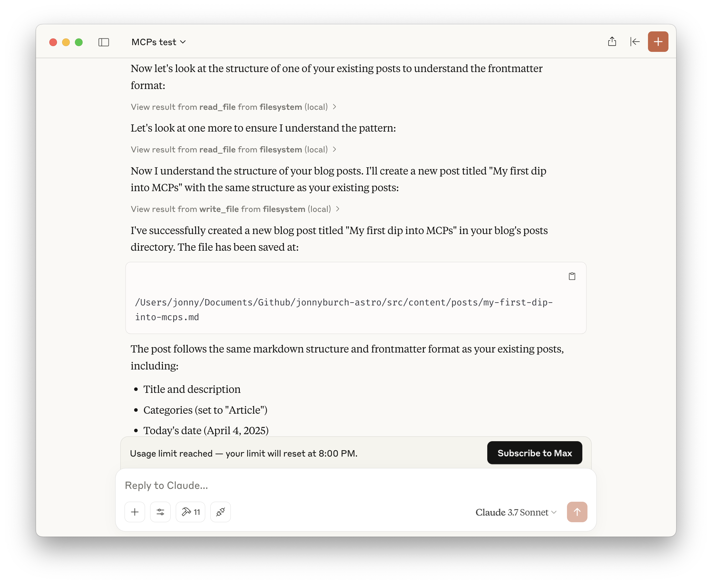

### Introduction: What is Model Context Protocol (MCP)?

I keep hearing the term Model Context Protocol (MCP) popping up, often wrapped in the kind of [breathless tech-bro hype](https://x.com/sundarpichai/status/1910082615975313788) that makes even the broader AI movement look slow moving. Described as 'an open protocol that standardizes how applications [provide context to LLMs](https://modelcontextprotocol.io/introduction)', the promise is big: think USB-C, but for plugging AI into data and tools.

As someone trying to figure out where AI tooling is *actually* heading beyond the buzzwords, and given Anthropic's protocol is now being adopted by Google and openAI, I decided it was time to get my hands dirty and explore.

### My Starting Point: Filesystem Access

My first concrete step into the MCP world was enabling filesystem access within Claude Desktop. This felt like a tangible way to see the protocol in action – allowing the AI to interact directly with local files seemed like a powerful and practical use case.

It was straightforward enough to toggle on and add the small config for, and immediately opened up possibilities for referencing local documents or codebases directly in my interactions.

I tested it by creating the file in the correct folder, with correct frontmatter, for this here blog post, directly from the claude UI. Claude took a couple of attempts to find the right folder but it searched, checked frontmatter from my other posts and created the file fairly efficiently. Cool - but not that much quicker than me running my `blog post` command in Cursor.

### Initial Impressions: Powerful but Early

This is where the "early days" feeling kicked in. Despite being technically inclined, understanding the server side of MCP wasn't immediately obvious. The documentation mentions a [client-server architecture](https://modelcontextprotocol.io/introduction), but the practical steps of creating, hosting, and connecting a custom server felt murky – **like trying to follow assembly instructions written in a language I only half-understand.** It highlighted a stark gap between the promise of MCPs and the actual developer experience. And that's just it - it's still a developer-centric experience - as I discovered when going beyond Claude's interface.

Admittedly I only gave it a further 20 minutes, but I was expecting to be able to add the git mcp so I could create a branch for my new blog post, push to my remote and maybe even publish. I immediately hit various walls of MCPs written in python requiring an MCP server. Hmm.

No doubt I'll work this out, but MCPs are still outside the ability of most. Maybe that's ok, if what they're replacing is APIs. But I digress.

### The Hype vs. Reality: Seeing the Potential

Despite it not being a super easy setup, I could immediately feel the potential for this technology.

Perhaps these interfaces become primarily documented *for* and consumed *by* AI agents via protocols like MCP, maybe even **background noise** primarily consumed *by* AI agents via protocols like MCP.

The AI could seamlessly pull data from a local database, query a remote service via its MCP integration, and synthesize information without the user (or even the developer, beyond the initial setup) needing to manage individual API calls and data transformations.

This aligns with the promise of flexibility and integration that MCP [aims for](https://modelcontextprotocol.io/introduction). If the user experience catches up to the vision, it could fundamentally change how we think about software interacting with data and services.

And for anyone that's had to parse the rats nest of a badly documented API, it sure feels like a game changer.

### Next Steps & The Road Ahead

This initial dip has only scratched the surface. So, my next mission is to actually dig into the server development side.

I plan to explore the available SDKs (Python, TypeScript etc. mentioned on the site) and check out the [example servers](https://modelcontextprotocol.io/introduction#examples) to get a better handle on how they're built and deployed.

While MCP feels like it's in its nascent stages with room for improvement in developer experience and tooling clarity, the core concept is powerful. Standardizing context exchange for LLMs feels like a necessary evolutionary step. I'm excited to continue learning and experimenting in this space and will share more as I go.

It feels a bit like navigating without a map right now, but the potential destination seems worth the trek. I'll report back on what I find.
