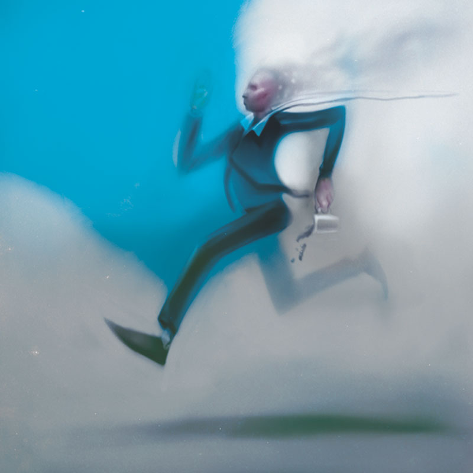
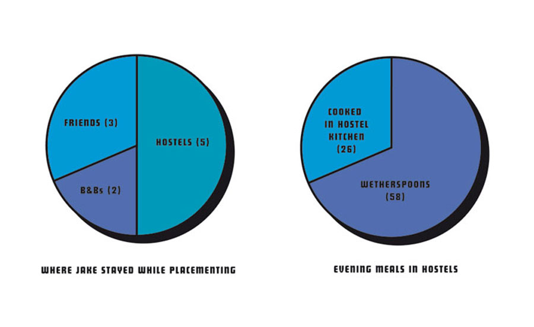

**If you’re reading this in bed, tin of cold baked beans in hand and Come Dine With Me on the telly, probably recovering from a night out where your housemate puked in their own pants and you put it on Instagram with a tilt shift so it looked like the bits of carrot were made out of plasticine, the last thing on your mind is going to be getting out into the world of work before you absolutely have to.**

And why should you? All that grown-up stuff can wait. Even with mere months to go, placements and, heaven forbid, jobs, seem pretty far away. Yes, the final project deadlines are looming, you’ve nailed your ideas and your presentation at your degree show is going to kick some serious ass. That kind of work is understandable, it’s for your degree, but real life comes after a summer of festivals and bleary sunburnt mornings in mysterious beds. Probably.

Well here’s another thing to consider: gaining a bit of industry experience is going to seriously help you out when it comes to getting to the next bit of your life as a creative. As often as not, creative studios are a bit like Uni. Yes there’s plenty of cracking work going on, but you’ll also be taking part in a great social scene and meeting people who will be useful lifelong contacts. As well as that, you get to learn how an agency works, possibly gather some nice live portfolio work and get a taste of working with people (great) under people (challenging) and for client people (more challenging). To top it off, agencies often don’t advertise junior positions, instead preferring to find young talent through internships, so you may just get an offer. Luckily for you, we have just the man to help you out with the where, why and how of the placement game.

Placement Man, aka designer Jake Jennings, has so far successfully completed nine placements since graduating from his design degree at Plymouth University last year. Among his battles he can list such huge adversaries as Hat-trick in London; Navyblue in Edinburgh; and even Pentagram New York. Along the way he’s accrued a comprehensive knowledge of how to find a placement, what to expect from it, how to make the most of it, and even convert it into a job offer (he’s had several).

Jake began networking before he left university, starting a Designers Society and holding events and lectures with speakers including Patrick Baglee (Navyblue) and Harry Pearce (Pentagram) for his contemporaries. However, it was a tour of 23 UK studios, portfolio in hand, that was to seal his first few placements, culminating in a month at Pentagram New York, after which he planned to settle down.

In the end, Jake explains, a combination of itchy feet and animalistic drive led him to carry on placement-hunting after returning from the US, something that he admits is often difficult to explain to people, the reasoning is that he still hasn’t worked out exactly what’s right for him. To be fair, it’s often hard to choose between a small or large agency, branding, packaging, print or digital without trying a couple out. Even hating an experience means you can cross one off the list.

It can also be daunting looking for placements, especially at the top agencies, but through Jake’s technique – a mixture of perseverance, charm and cojones – should see you through. (Though don’t carpet-bomb CVs – it’s easier to spot than you would think.) Jake says he has gained placements through email, face-to-face meetings and even Twitter, and would advise anyone else to do the same. Most importantly, he adds, don’t be disheartened if a company does not or cannot offer you a spot, just make sure you get their honest opinion on your work, even if it hurts. It will all help you to improve it for the future.

If a studio does offer you a placement but can’t offer payment, don’t necessarily turn it down – one of Jake’s favourite placements, Navyblue Edinburgh, were honest and after a difficult financial year said they couldn’t pay him but instead offered him the chance to work on a variety of live briefs which led to his work being shown to the client. However, beware of studios taking the piss, because some will (one studio had interns booked solidly for the six months after Jake, begging the question ‘Is this just free labour?’)

Some studios will also offer better work than others – with everything from being treated as an “artworker” to meeting clients and being fully involved creatively. Be prepared to make tea and suck it up (not the tea) if some of your work doesn’t seem overly stimulating. Studios often have peaks and troughs of exciting work anyway, but try to stay enthusiastic, make the most of what you’re given and become invaluable in any way you can (people still request the “Jake special tea” at one company he now freelances at having previously been an intern). The creative world is a small one, you never know who you’ll meet again.

But I had to ask, why spend 18 months bed-hopping round some pretty ropey sounding hostels and B&Bs, living out of a suitcase and having to relearn people’s names every other month? Well, despite those things the experience has been overwhelmingly positive, Jake says. There’s no doubt he’s well equipped to start up a functioning studio (having clocked so many) or freelance with all the contacts he’s gained, but he remains set on working full time in a studio for a couple of years at least. The question is, will Placement Man ever hang up his cape in exchange for a salary?

_This article was originally posted in ShellsuitZombie magazine issue 2 in 2011, which you can see [here](https://shellsuitzombie.co.uk/magazine/)._

_Illustrations by one of my best mates [Bora Demirbilek](https://www.blogobora.com/)_

---
